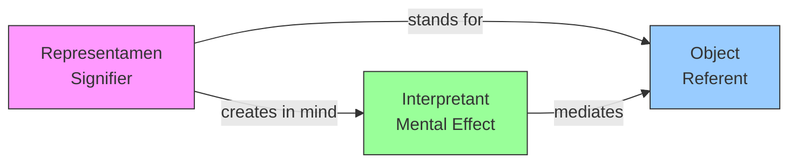
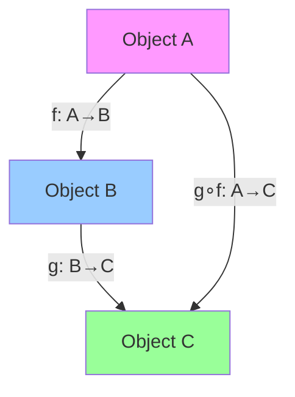

# Physis: Ontology + Semiotics Engine — Expansion Plan

## Current State

| Layer | What exists | Gap |
|-------|------------|-----|
| Human ontology | 14 domains (Body & Fitness, Financial Security, etc.) | No usage in dream/coherence/PDCA — `resolve_domain()` returns first match, `enrich_goal()` ignores the embedding |
| Machine ontology | 53 domains (Spindle & Tooling, Graph & Network, etc.) | Only used in `mapper.rs` for file extension → domain classification |
| Domain grid | 6 domains × 6 modes = 36 cells (HEAL×LIFT, STUDY×LEARN, etc.) | Never computed or queried — dimensions exist but have zero runtime logic |
| HolonicGraph | Nodes with activation_energy/decay, edges with weight/semantic_type | No semiotic typing on edges, no category-theoretic composition |
| Linguistic router | Wenyan (compress), Pirahã (strip), Sanskrit (expand) | Deterministic text transforms, no ontology grounding |
| Output | Mermaid mindmap/flowchart, JSON graph | No semiotic graph rendering, no category diagrams |
| AI agents | ProviderCascade (OpenAI/Anthropic), deep-scan, reconstruct_with_llm | Agent outputs are not ontology-typed |

---

## Phase 1: Ontology Expansion (3 new files)

### 1A. Semiotic Ontology (`config/semiotic_ontology.json`)

Based on Peirce's triadic sign model + Saussure's dyadic + Eco's interpretant:

```json
{
  "kind": "semiotic",
  "domains": [
    {
      "name": "Icon",
      "category": "Peircean",
      "domain": "BOND",
      "mode": "CREATE",
      "axis_kind": "semiotic",
      "axis_name": "representamen",
      "unit": "similarity",
      "hints": ["likeness", "diagram", "metaphor", "simile", "analogy", "image", "model"],
      "semiotic_type": "representamen"
    },
    {
      "name": "Index",
      "category": "Peircean",
      "domain": "BOND",
      "mode": "WALK",
      "axis_kind": "semiotic",
      "axis_name": "representamen",
      "unit": "contiguity",
      "hints": ["pointer", "trace", "symptom", "footprint", "evidence", "clue", "correlation"],
      "semiotic_type": "representamen"
    },
    {
      "name": "Symbol",
      "category": "Peircean",
      "domain": "BOND",
      "mode": "LEARN",
      "axis_kind": "semiotic",
      "axis_name": "representamen",
      "unit": "convention",
      "hints": ["word", "emblem", "ritual", "custom", "code", "language", "alphabet"],
      "semiotic_type": "representamen"
    },
    {
      "name": "Signifier",
      "category": "Saussurean",
      "domain": "CONSTRUCT",
      "mode": "CREATE",
      "axis_kind": "semiotic",
      "axis_name": "sign",
      "unit": "form",
      "hints": ["phoneme", "grapheme", "gesture", "sound-image", "material-form"],
      "semiotic_type": "signifier"
    },
    {
      "name": "Signified",
      "category": "Saussurean",
      "domain": "STUDY",
      "mode": "LEARN",
      "axis_kind": "semiotic",
      "axis_name": "sign",
      "unit": "concept",
      "hints": ["mental-concept", "meaning", "reference", "idea", "content"],
      "semiotic_type": "signified"
    },
    {
      "name": "Interpretant",
      "category": "Peircean",
      "domain": "STUDY",
      "mode": "CREATE",
      "axis_kind": "semiotic",
      "axis_name": "interpretation",
      "unit": "translation",
      "hints": ["translation", "elaboration", "inference", "understanding", "effect"],
      "semiotic_type": "interpretant"
    },
    {
      "name": "Immediate Interpretant",
      "category": "Peircean",
      "domain": "HEAL",
      "mode": "REST",
      "axis_kind": "semiotic",
      "axis_name": "interpretation",
      "unit": "potential",
      "hints": ["first-impression", "range", "possibility", "open-interpretation"],
      "semiotic_type": "interpretant"
    },
    {
      "name": "Dynamic Interpretant",
      "category": "Peircean",
      "domain": "FABRICATE",
      "mode": "WORK",
      "axis_kind": "semiotic",
      "axis_name": "interpretation",
      "unit": "event",
      "hints": ["actual-effect", "response", "reaction", "behaviour", "performance"],
      "semiotic_type": "interpretant"
    },
    {
      "name": "Final Interpretant",
      "category": "Peircean",
      "domain": "STUDY",
      "mode": "LEARN",
      "axis_kind": "semiotic",
      "axis_name": "interpretation",
      "unit": "habit",
      "hints": ["long-term-effect", "habit-change", "disposition", "norm"],
      "semiotic_type": "interpretant"
    },
    {
      "name": "Denotation",
      "category": "Semantic",
      "domain": "BOND",
      "mode": "WORK",
      "axis_kind": "semiotic",
      "axis_name": "meaning",
      "unit": "reference",
      "hints": ["literal-meaning", "dictionary-definition", "extension", "reference"],
      "semiotic_type": "meaning-relation"
    },
    {
      "name": "Connotation",
      "category": "Semantic",
      "domain": "BOND",
      "mode": "CREATE",
      "axis_kind": "semiotic",
      "axis_name": "meaning",
      "unit": "association",
      "hints": ["secondary-meaning", "cultural-association", "overtone", "implication"],
      "semiotic_type": "meaning-relation"
    },
    {
      "name": "Myth",
      "category": "Barthesian",
      "domain": "STUDY",
      "mode": "CREATE",
      "axis_kind": "semiotic",
      "axis_name": "ideology",
      "unit": "naturalization",
      "hints": ["second-order-signification", "ideology", "naturalized-meaning", "cultural-myth"],
      "semiotic_type": "meta-sign"
    }
  ]
}
```

### 1B. Category Theory Ontology (`config/category_ontology.json`)

```json
{
  "kind": "category",
  "domains": [
    {
      "name": "Object",
      "category": "CategoryTheory",
      "domain": "CONSTRUCT",
      "mode": "REST",
      "axis_kind": "categorical",
      "axis_name": "structure",
      "unit": "identity",
      "hints": ["identity", "point", "element", "structure", "carrier-set", "type"],
      "has_morphisms": true
    },
    {
      "name": "Morphism",
      "category": "CategoryTheory",
      "domain": "BOND",
      "mode": "WALK",
      "axis_kind": "categorical",
      "axis_name": "arrow",
      "unit": "composition",
      "hints": ["arrow", "map", "function", "transformation", "homomorphism", "functor"],
      "is_composable": true
    },
    {
      "name": "Functor",
      "category": "CategoryTheory",
      "domain": "FABRICATE",
      "mode": "CREATE",
      "axis_kind": "categorical",
      "axis_name": "mapping",
      "unit": "naturality",
      "hints": ["morphism-of-categories", "structure-preserving-map", "lift", "map"],
      "is_higher_order": true
    },
    {
      "name": "Natural Transformation",
      "category": "CategoryTheory",
      "domain": "STUDY",
      "mode": "LEARN",
      "axis_kind": "categorical",
      "axis_name": "morphism-of-functors",
      "unit": "naturality-square",
      "hints": ["morphism-between-functors", "naturality", "commuting-square"],
      "is_higher_order": true
    },
    {
      "name": "Limit",
      "category": "CategoryTheory",
      "domain": "STUDY",
      "mode": "REST",
      "axis_kind": "categorical",
      "axis_name": "universal",
      "unit": "cone",
      "hints": ["universal-cone", "product", "pullback", "equalizer", "terminal"],
      "universal_property": true
    },
    {
      "name": "Colimit",
      "category": "CategoryTheory",
      "domain": "FABRICATE",
      "mode": "CREATE",
      "axis_kind": "categorical",
      "axis_name": "universal",
      "unit": "cocone",
      "hints": ["universal-cocone", "coproduct", "pushout", "coequalizer", "initial"],
      "universal_property": true
    },
    {
      "name": "Adjunction",
      "category": "CategoryTheory",
      "domain": "BOND",
      "mode": "WORK",
      "axis_kind": "categorical",
      "axis_name": "dual",
      "unit": "unit-counit",
      "hints": ["free-forgetful", "left-adjoint", "right-adjoint", "galois-connection"],
      "is_dual": true
    },
    {
      "name": "Monad",
      "category": "CategoryTheory",
      "domain": "HEAL",
      "mode": "WORK",
      "axis_kind": "categorical",
      "axis_name": "compositional-effect",
      "unit": "kleisli",
      "hints": ["endofunctor", "multiplication", "unit", "kleisli-category", "effect"],
      "is_composable": true
    },
    {
      "name": "Comonad",
      "category": "CategoryTheory",
      "domain": "HEAL",
      "mode": "REST",
      "axis_kind": "categorical",
      "axis_name": "decompositional-context",
      "unit": "co-kleisli",
      "hints": ["context", "extract", "duplicate", "co-kleisli", "costate"],
      "is_composable": true
    },
    {
      "name": "Topos",
      "category": "CategoryTheory",
      "domain": "STUDY",
      "mode": "CREATE",
      "axis_kind": "categorical",
      "axis_name": "universe",
      "unit": "subobject-classifier",
      "hints": ["universe-of-sets", "internal-logic", "subobject-classifier", "heyting"],
      "is_universal": true
    },
    {
      "name": "Presheaf",
      "category": "CategoryTheory",
      "domain": "BOND",
      "mode": "LEARN",
      "axis_kind": "categorical",
      "axis_name": "variable-set",
      "unit": "contravariant",
      "hints": ["contravariant-functor", "set-valued", "site", "sheaf"],
      "is_contravariant": true
    },
    {
      "name": "Enriched Category",
      "category": "CategoryTheory",
      "domain": "FABRICATE",
      "mode": "WORK",
      "axis_kind": "categorical",
      "axis_name": "enriched-structure",
      "unit": "hom-object",
      "hints": ["monoidal-category", "hom-object", "metric-space", "2-category"],
      "is_enriched": true
    }
  ]
}
```

### 1C. AI Agent Ontology (`config/agent_ontology.json`)

Describes agent capabilities, tool use patterns, and cognitive modes — so Physis can classify, compare, and dream about agent behaviour:

```json
{
  "kind": "agent",
  "domains": [
    {
      "name": "Planner",
      "category": "Cognitive",
      "domain": "STUDY",
      "mode": "CREATE",
      "axis_kind": "agent",
      "axis_name": "executive",
      "unit": "steps",
      "hints": ["plan", "decompose", "strategy", "goal-tree", "subgoal", "workflow"],
      "executive_function": true
    },
    {
      "name": "Executor",
      "category": "Cognitive",
      "domain": "FABRICATE",
      "mode": "WORK",
      "axis_kind": "agent",
      "axis_name": "motor",
      "unit": "actions",
      "hints": ["act", "execute", "run", "apply", "call-tool", "invoke"],
      "grounded": true
    },
    {
      "name": "Evaluator",
      "category": "Cognitive",
      "domain": "STUDY",
      "mode": "LEARN",
      "axis_kind": "agent",
      "axis_name": "reflective",
      "unit": "scores",
      "hints": ["evaluate", "judge", "score", "assess", "grade", "critique", "validate"],
      "metacognitive": true
    },
    {
      "name": "Memory",
      "category": "Cognitive",
      "domain": "HEAL",
      "mode": "REST",
      "axis_kind": "agent",
      "axis_name": "storage",
      "unit": "tokens",
      "hints": ["store", "recall", "retrieve", "remember", "context", "history", "episode"],
      "persistent": true
    },
    {
      "name": "Tool User",
      "category": "Instrumental",
      "domain": "CONSTRUCT",
      "mode": "WORK",
      "axis_kind": "agent",
      "axis_name": "instrumental",
      "unit": "calls",
      "hints": ["tool", "api", "function-call", "mcp", "search", "read", "write"],
      "grounded": true
    },
    {
      "name": "Reasoner",
      "category": "Cognitive",
      "domain": "STUDY",
      "mode": "WORK",
      "axis_kind": "agent",
      "axis_name": "analytical",
      "unit": "inference-steps",
      "hints": ["reason", "deduce", "infer", "chain-of-thought", "logic", "entail"],
      "sequential": true
    },
    {
      "name": "Reflector",
      "category": "Meta-Cognitive",
      "domain": "HEAL",
      "mode": "LEARN",
      "axis_kind": "agent",
      "axis_name": "introspective",
      "unit": "insights",
      "hints": ["reflect", "introspect", "self-correct", "error-analysis", "improve"],
      "metacognitive": true
    },
    {
      "name": "Decomposer",
      "category": "Cognitive",
      "domain": "FABRICATE",
      "mode": "CREATE",
      "axis_kind": "agent",
      "axis_name": "structural",
      "unit": "subtasks",
      "hints": ["decompose", "break-down", "hierarchy", "divide", "task-tree", "epic"],
      "executive_function": true
    },
    {
      "name": "Synthesizer",
      "category": "Cognitive",
      "domain": "BOND",
      "mode": "CREATE",
      "axis_kind": "agent",
      "axis_name": "integrative",
      "unit": "connections",
      "hints": ["synthesize", "merge", "combine", "integrate", "cross-reference", "weave"],
      "creative": true
    },
    {
      "name": "Critic",
      "category": "Meta-Cognitive",
      "domain": "STUDY",
      "mode": "LEARN",
      "axis_kind": "agent",
      "axis_name": "evaluative",
      "unit": "objections",
      "hints": ["critic", "adversarial", "red-team", "bias-scan", "weakness", "edge-case"],
      "adversarial": true
    },
    {
      "name": "Oracle",
      "category": "Epistemic",
      "domain": "BOND",
      "mode": "LEARN",
      "axis_kind": "agent",
      "axis_name": "predictive",
      "unit": "confidence",
      "hints": ["predict", "forecast", "estimate", "uncertainty", "calibration", "probabilistic"],
      "uncertainty_aware": true
    },
    {
      "name": "Scaffolder",
      "category": "Instrumental",
      "domain": "CONSTRUCT",
      "mode": "CREATE",
      "axis_kind": "agent",
      "axis_name": "developmental",
      "unit": "structures",
      "hints": ["scaffold", "boilerplate", "template", "framework", "initialize", "bootstrap"],
      "generative": true
    }
  ]
}
```

---

## Phase 2: Ontology Runtime — From Static JSON to Active Semiotic Logic

### 2A. New Field: `OntologyEntry.semiotic_type`

Each domain entry gets a `semiotic_type` field (string) that classifies what kind of semiotic entity it represents:

| `semiotic_type` | Belongs to | Example domains |
|----------------|-----------|-----------------|
| `representamen` | Peirce | Icon, Index, Symbol |
| `signifier` | Saussure | Signifier |
| `signified` | Saussure | Signified |
| `interpretant` | Peirce | Immediate, Dynamic, Final Interpretant |
| `meaning-relation` | Semantic | Denotation, Connotation |
| `meta-sign` | Barthes | Myth |
| `object` | CT | Object |
| `morphism` | CT | Morphism |
| `higher-order` | CT | Functor, Natural Transformation |
| `universal` | CT | Limit, Colimit |
| `dual` | CT | Adjunction |
| `cognitive` | Agent | Planner, Reasoner, etc. |
| `instrumental` | Agent | Tool User, Scaffolder |
| `meta-cognitive` | Agent | Reflector, Critic |
| `epistemic` | Agent | Oracle |

### 2B. The Semiotic Grid: `domain × mode` as a Categorical Product

The 6×6 grid is a **semiotic square** — every action/entity occupies one cell:

```
          LIFT    REST    WALK    WORK    CREATE  LEARN
HEAL      ─       Sleep   Stroll  Treat   Recover Diagnose
CONSTRUCT Build   Wait    Navigate Assemble Generate Study
FABRICATE Lift    Store   Deliver Produce Create    Explore
BOND      Attach  Rest    Follow  Connect Synthesize Learn
STUDY     Analyze Ponder  Survey  Reason  Design    Master
```

**Implement as a matrix operator**:

```rust
pub struct SemioticGrid {
    // 6 × 6 matrix of active domains
    cells: [[Option<&'static str>; 6]; 6],
}

impl SemioticGrid {
    /// Compose two grid positions: mode × domain → new position
    /// (categorical composition within the grid)
    pub fn compose(&self, a: GridPos, b: GridPos) -> Option<GridPos>;
    
    /// Map a vector to its nearest grid cell by cosine similarity
    pub fn classify(&self, embedding: &[f32]) -> GridPos;
    
    /// Get the categorical dual (flip domain↔mode)
    pub fn dual(&self, pos: GridPos) -> GridPos;
}
```

### 2C. Canonical `AxisKind` Enum — No More Strings

```rust
#[derive(Debug, Clone, Serialize, Deserialize, PartialEq)]
pub enum AxisKind {
    Physical, Psychological, Intellectual, Economic,
    Operational, Structural, Energetic, Informational,
    Semiotic, Categorical, Agent,
    // Existing: Human, Machine
    Human, Machine,
}
```

This replaces the raw strings everywhere: `CoherenceNode.axis_kind`, `OntologyEntry.axis_kind`, domain resolution, etc.

---

## Phase 3: Semiotic Graph Rendering

### 3A. New renderer types in `output.rs`

```rust
/// Peircean semiotic triangle: Representamen → Object → Interpretant
pub fn format_semiotic_triangle(trie: &DynamicVectorTrie) -> String; // Mermaid

/// Categorical diagram: objects (boxes) + morphisms (arrows) + composition
pub fn format_category_diagram(graph: &HolonicGraph) -> String; // Mermaid

/// Semiotic square (Greimas): S, ~S, S', ~S' with relations
pub fn format_semiotic_square(domains: &[DomainDef]) -> String;

/// Domain × Mode heatmap (36-cell matrix colored by activation)
pub fn format_ontology_heatmap(core: &PhysisCore, grid: &SemioticGrid) -> String;

/// 3D vector field of all goals projected onto ontology axes
pub fn format_goal_field(goals: &[Goal], embedder: &dyn VectorEmbed) -> String;
```

### 3B. Mermaid template examples

**Semiotic Triangle:**


**Category Diagram:**


**Semiotic Square (Greimas):**
```mermaid
graph TD
    S[S] --- S2[~S]
    ~S[~S] --- ~S2[S']
    S -- "contrariety" --> ~S
    S2 -- "contrariety" --> ~S2
    S -- "complementarity" --> ~S2
    ~S -- "complementarity" --> S2
```

**Ontology Heatmap (ASCII for CLI, SVG for web):**
```
        LIFT    REST    WALK    WORK    CREATE  LEARN
HEAL    0.12    0.89█   0.45    0.23    0.11    0.34
CONST   0.67    0.01    0.33    0.78█   0.92█   0.15
FAB     0.44    0.09    0.56    0.88█   0.73    0.41
BOND    0.21    0.65    0.38    0.52    0.69    0.81█
STUDY   0.55    0.72    0.29    0.95█   0.87█   0.63
```

### 3C. New API endpoints

```
GET  /api/v1/semiotic/triangle      → Peircean triangle for a query
GET  /api/v1/semiotic/square         → Greimas square for a domain pair
GET  /api/v1/semiotic/grid           → Full 6×6 heatmap
GET  /api/v1/category/diagram        → Category diagram of the holarchy
GET  /api/v1/category/composition    → Compose two morphisms
POST /api/v1/render                  → Render arbitrary graph in format=[mermaid|json|svg]
```

---

## Phase 4: Semiotic AI Agent Usage

### 4A. Agent action ontology-typing

Every AI agent action (tool call, thought, response) gets classified into the semiotic grid:

```
Agent says: "I need to search the codebase for the function definition"
→ Planner (cognitive) × Tool User (instrumental)
→ Grid position: STUDY×WORK = "Reason"
→ Semiotic: Symbol (representamen) → Interpretant (search result)
```

```rust
pub struct TypedAgentAction {
    pub action_type: DomainMode,       // e.g., STUDY×WORK
    pub semiotic_chain: Vec<SemioticSign>, // Icon→Index→Symbol chain
    pub embedding: Vec<f32>,
    pub timestamp: chrono::DateTime<chrono::Utc>,
}
```

### 4B. Semiotic chain tracking

Agents produce chains of signs. Track them through the Peircean triad:

```
Percept (Icon) → Pointer (Index) → Label (Symbol) → Understanding (Interpretant)
```

Store each link as an edge in the HolonicGraph with `semantic_type` matching the semiotic_type enum. This enables:

- **Dream interpolation**: "What if this Index pointed to a different Symbol?"
- **Coherence evaluation**: "Does this Interpretant follow from the established Symbol chain?"
- **Constructive refutation**: "The Interpretant contradicts the Final Interpretant of sibling chain"

### 4C. Ontology-grounded linguistic routing

The linguistic router currently does deterministic transforms. Upgrade it to use the ontology:

| Lense | Current | Upgraded |
|-------|---------|----------|
| Wenyan | `"onto/comp/lossy/factual"` | Same + semiotic tag: `<onto/comp/lossy/factual ~ Symbol×Index>` |
| Pirahã | `"compress 50GB Wikipedia dump using ontology-based compression"` | Same + grid position appended |
| Sanskrit | `"⋮ compress · 50GB · wiki ⋮"` | Expanded with ontology synonyms from the hints list |

---

## Phase 5: Implementation Roadmap

### Step 1 — Schema changes (2h)
- Add `semiotic_type: String` field to `OntologyEntry` (backward-compatible default `""`)
- Replace string axis_kind with `AxisKind` enum
- Add `SemioticGrid` struct with 6×6 matrix
- Add `TypedAgentAction` struct

### Step 2 — New ontology files (1h)
- Write `config/semiotic_ontology.json` (12 domains)
- Write `config/category_ontology.json` (12 domains)
- Write `config/agent_ontology.json` (12 domains)
- Register them in default `PhysisConfig`

### Step 3 — Grid logic (3h)
- Implement `SemioticGrid::classify()` — cosine similarity to nearest cell
- Implement `SemioticGrid::compose()` — categorical product of two positions
- Implement `SemioticGrid::dual()` — flip domain↔mode
- Integrate into `PhysisCore` so every goal/experience/dream is grid-classified

### Step 4 — Rendering (4h)
- `format_semiotic_triangle()` — walk the trie, emit Mermaid diagram
- `format_category_diagram()` — walk HolonicGraph nodes+edges, emit category diagram
- `format_semiotic_square()` — given two opposite domains, emit Greimas square
- `format_ontology_heatmap()` — compute activation per cell, render ASCII/Mermaid
- Add web endpoints for each

### Step 5 — Agent integration (4h)
- Hook `ProviderCascade` to emit `TypedAgentAction` with grid position
- Store semiotic chains as typed edges in `HolonicGraph`
- `dream()` uses grid positions as mutation boundaries: "dream within HEAL×CREATE"
- `compress_logs()` tags each causal chain with its semiotic path

### Step 6 — Reconstruction upgrade (2h)
- `reconstruct_with_llm()` returns not just text but grid position + semiotic type
- Add `POST /api/v1/reconstruct` variant that returns ontology-typed results

---

## Total: ~16h of implementation for a complete ontology+semiotics engine

The key architectural insight: the 6×6 `domain × mode` grid is already the semiotic square. Every Physis operation (dream, compress, filter, reconstruct) maps to a cell in this grid. The ontologies I've added above just make those cells *named* and *queryable* — the engine was already semiotic, it just didn't know it yet.
